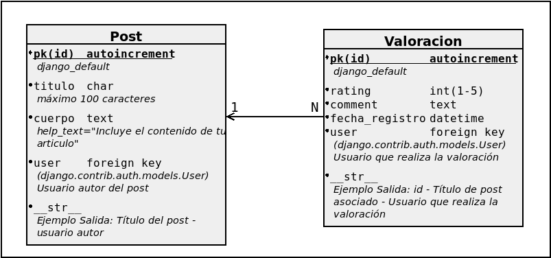

# DWES - Prueba Práctica individual

Vamos a crear una API REST con Django Rest Framework
para la gestión de Posts y valoraciones que se sustenta
sobre los siguientes modelos:

## Creación de Modelos (2pt)
- Modelo Post:
  - Campos correctos.
  - Nombre Plural.
  - Implementación en Base de datos.
  - Transformación a cadena.
- Modelo Valoracion:
  - Campos correctos.
  - Nombre Plural.
  - Implementación en Base de datos.
  - Transformación a cadena.

## CRUD Post (4 pt)

Crea con Django Rest Framework un CRUD para los Post:

- El serializador ha de llamarse PostSerializer
  - Deriva del modelo Post
  - Estar hyperlinkado (Campo url)
  - El campo user debe formarse con un serializador PrimaryKeyRelatedField
- Para las operaciones de escritura es necesario estar autenticado
  - El admin puede manipular todo
  - Un usuario normal, sólo sus posts
    - El usuario normal puede asignar un post a cualquier usuario, en cuyo caso después no puede modificarlo.
- El basename para el registro del Router en la urls ha de ser basename="post" 

## CRUD Rating (4 pt)

Crea con Django REST Framework un CRUD para las Valoraciones:

- El serializador ha de llamarse ValoracionSerializer.
  - Haz que la API sea browsable y este Hyperlinkada (campos url y post navegables).
  - El campo user es de sólo lectura.
  - El campo user debe formarse con un serializador PrimaryKeyRelatedField.
- Para publicar es necesario estar logado.
- El usuario y fecha de la valoración se asignan automáticamente al crearse.
- El user asignado a la valoracion es el usuario que realiza la petición de creación, una vez creada la valoración el user es de sólo lectura.
- Se debe poder ordenar por fecha_registro.
  - La url de este servicio será del tipo "/valoraciones/?ordering=fecha_registro" (Asc) y "/valoraciones/?ordering=-fecha_registro" (Desc).
- El basename para el registro del Router en la urls ha de ser basename="valoracion".
